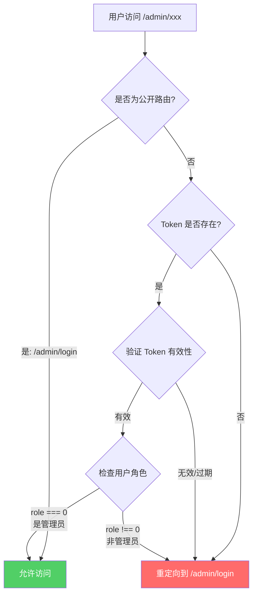

# 管理后台权限保护中间件规范

**版本**: v1.0  
**创建时间**: 2026-01-16  
**负责人**: Security Team  
**优先级**: P0（严重安全漏洞修复）

---

## 一、功能描述

### 1.1 核心目标

为管理后台系统实现完整的身份验证和权限控制机制，确保：
- 所有管理后台页面（`/admin/*`）仅允许已登录的管理员访问
- 所有管理后台 API（`/api/admin/*`）仅允许已授权的管理员调用
- 未授权访问自动重定向到管理员登录页
- 支持登录后回跳到原始访问页面

### 1.2 安全问题

当前系统存在的严重安全漏洞：
- ❌ 任何人可直接通过 URL 访问管理后台页面
- ❌ 缺少管理员角色验证（role === 0）
- ❌ API 接口未受保护，可被任意调用
- ❌ 无权限校验机制

### 1.3 解决方案

采用 **Next.js 15 Middleware** 实现统一的权限拦截层：
- ✅ 在请求到达页面/API 前进行拦截
- ✅ 验证 JWT Token 的有效性
- ✅ 验证用户角色是否为管理员
- ✅ 自动重定向未授权访问

---

## 二、功能逻辑

### 2.1 验证流程



### 2.2 路由分类

#### 管理后台受保护路由（需要管理员权限）

```typescript
const ADMIN_PROTECTED_ROUTES = ['/admin', '/api/admin']
```

具体包括：
- **页面路由**：
  - `/admin/dashboard` - 管理后台首页
  - `/admin/users` - 用户管理
  - `/admin/audit` - 审计日志
  - 所有其他 `/admin/*` 页面

- **API 路由**：
  - `/api/admin/users` - 用户管理 API
  - `/api/admin/users/[id]/status` - 用户状态管理
  - `/api/admin/audit-logs` - 审计日志 API
  - 所有其他 `/api/admin/*` 接口

#### 管理后台公开路由（无需登录）

```typescript
const ADMIN_PUBLIC_ROUTES = ['/admin/login']
```

仅包括：
- `/admin/login` - 管理员登录页

### 2.3 权限验证逻辑

#### Step 1: 路由匹配

```typescript
// 判断是否为管理后台路由
const isAdminRoute = pathname.startsWith('/admin') || pathname.startsWith('/api/admin')

// 判断是否为公开路由
const isPublicRoute = pathname === '/admin/login'
```

#### Step 2: Token 验证

```typescript
// 从 Cookie 中获取 Token
const token = request.cookies.get('auth_token')?.value

// Token 不存在 → 重定向到登录页
if (!token) {
  return redirectToAdminLogin(pathname)
}

// 验证 Token 有效性（使用 jose 库）
const payload = await verifyToken(token)

// Token 无效或过期 → 重定向到登录页
if (!payload) {
  return redirectToAdminLogin(pathname)
}
```

#### Step 3: 角色验证

```typescript
// 验证用户角色（0-管理员, 1-普通用户）
if (payload.role !== 0) {
  // 非管理员 → 重定向到登录页
  return redirectToAdminLogin(pathname, 'unauthorized')
}

// 验证通过，允许访问
return NextResponse.next()
```

### 2.4 重定向规则

#### 重定向目标

所有未授权访问都重定向到：`/admin/login`

#### 携带参数

```typescript
// 保存原始访问路径，便于登录后回跳
const url = new URL('/admin/login', request.url)
url.searchParams.set('redirect', pathname)

// 如果是权限不足，额外携带错误信息
if (reason === 'unauthorized') {
  url.searchParams.set('error', 'unauthorized')
}

return NextResponse.redirect(url)
```

#### 示例

| 原始访问路径 | 重定向目标 | 说明 |
|------------|-----------|-----|
| `/admin/dashboard` | `/admin/login?redirect=/admin/dashboard` | 未登录 |
| `/admin/users` | `/admin/login?redirect=/admin/users` | Token 过期 |
| `/api/admin/users` | `/admin/login?redirect=/api/admin/users` | 非管理员 |

---

## 三、接口定义

### 3.1 Input（请求拦截）

#### 请求来源
- **类型**: HTTP Request
- **触发时机**: 所有匹配 matcher 的请求

#### 请求信息提取

```typescript
interface RequestInfo {
  pathname: string         // 请求路径，如 /admin/dashboard
  url: string             // 完整 URL
  cookies: {
    auth_token?: string   // JWT Token
  }
}
```

### 3.2 Output（响应处理）

#### 场景 1: 允许访问

```typescript
// 返回类型
NextResponse.next()

// HTTP 状态码: 200
// 行为: 请求继续传递到目标页面/API
```

#### 场景 2: 重定向到登录页（页面路由）

```typescript
// 返回类型
NextResponse.redirect(url)

// HTTP 状态码: 307 (Temporary Redirect)
// 目标: /admin/login?redirect={原始路径}
// 行为: 浏览器自动跳转到登录页
```

#### 场景 3: 返回 401 错误（API 路由）

```typescript
// 返回类型
NextResponse.json(
  { 
    error: 'Unauthorized', 
    message: '需要管理员权限' 
  },
  { status: 401 }
)

// HTTP 状态码: 401 (Unauthorized)
// 响应体: JSON 格式的错误信息
// 行为: 前端根据 401 状态码处理（如弹出登录提示）
```

### 3.3 JWT Payload 结构

```typescript
interface JWTPayload {
  userId: string    // 用户唯一标识 (UUID)
  phone: string     // 用户手机号
  role: number      // 用户角色: 0-管理员, 1-普通用户
  iat: number       // Token 签发时间 (issued at)
  exp: number       // Token 过期时间 (expiration)
}
```

---

## 四、数据库变更

**本功能无需修改数据库**

理由：
- 使用现有的 `users` 表中的 `role` 字段
- JWT Token 存储在客户端 Cookie 中
- 不需要新增表或字段

---

## 五、异常情况处理

### 5.1 未登录访问

**场景**: 用户直接访问 `/admin/dashboard`，但未登录

**检测逻辑**:
```typescript
if (!token) {
  // Token 不存在
}
```

**处理方式**:
- 重定向到 `/admin/login?redirect=/admin/dashboard`
- 登录成功后自动跳转回原页面

### 5.2 Token 无效或过期

**场景**: 用户的 Token 已过期或被篡改

**检测逻辑**:
```typescript
const payload = await verifyToken(token)
if (!payload) {
  // Token 验证失败
}
```

**处理方式**:
- 重定向到 `/admin/login?redirect={原始路径}`
- 清除客户端的无效 Token（可选）

**Token 验证失败的可能原因**:
1. Token 已过期（超过 `JWT_EXPIRY` 设置的时间）
2. Token 签名不匹配（`JWT_SECRET` 不一致）
3. Token 格式错误
4. Token 被篡改

### 5.3 非管理员访问

**场景**: 普通用户（role=1）尝试访问管理后台

**检测逻辑**:
```typescript
if (payload.role !== 0) {
  // 不是管理员角色
}
```

**处理方式**:
- 重定向到 `/admin/login?redirect={原始路径}&error=unauthorized`
- 登录页显示"需要管理员权限"提示

### 5.4 API 路由被直接调用

**场景**: 前端或第三方尝试直接调用 `/api/admin/*` 接口

**检测逻辑**:
```typescript
if (pathname.startsWith('/api/admin')) {
  // API 路由，返回 JSON 而不是重定向
}
```

**处理方式**:
```typescript
return NextResponse.json(
  { 
    success: false,
    error: 'Unauthorized', 
    message: '需要管理员权限' 
  },
  { status: 401 }
)
```

**与页面路由的区别**:
- 页面路由 → 重定向到登录页（用户友好）
- API 路由 → 返回 401 JSON（便于前端统一处理）

### 5.5 JWT_SECRET 环境变量缺失

**场景**: 服务器启动时未配置 `JWT_SECRET`

**检测逻辑**:
```typescript
const secret = process.env.JWT_SECRET
if (!secret || secret.length < 32) {
  throw new Error('JWT_SECRET环境变量未设置或长度不足32字符')
}
```

**处理方式**:
- 服务器启动失败（由 `verifyToken` 函数抛出异常）
- 确保部署时正确配置环境变量

### 5.6 并发请求处理

**场景**: 用户同时发起多个管理后台请求

**处理方式**:
- Middleware 对每个请求独立验证
- Token 验证是无状态的，不会相互影响
- 使用 JWT 避免了数据库查询，性能开销低

---

## 六、技术实现细节

### 6.1 使用的技术栈

- **Next.js 15**: App Router + Middleware
- **jose**: JWT Token 验证库（Node.js 官方推荐）
- **TypeScript**: 类型安全

### 6.2 Middleware 配置

```typescript
export const config = {
  matcher: [
    // 匹配所有路由，除了：
    // - /api (所有 API，由 /api/* 自行处理)
    // - /_next/static (静态资源)
    // - /_next/image (图片优化)
    // - /favicon.ico (网站图标)
    '/((?!_next/static|_next/image|favicon.ico).*)',
  ],
}
```

**注意**: 
- Matcher 使用正则表达式排除静态资源
- `/api/admin/*` 会被匹配到（不在排除列表中）

### 6.3 性能优化

#### Token 验证性能

- JWT 验证是**纯计算操作**，无需数据库查询
- 平均耗时：< 1ms
- 不会成为性能瓶颈

#### 避免重复验证

```typescript
// ✅ 好的做法：统一获取 Token
const token = request.cookies.get('auth_token')?.value

// ❌ 避免：多次读取 Cookie
if (pathname.startsWith('/admin')) {
  const token1 = request.cookies.get('auth_token')?.value
}
if (pathname.startsWith('/api/admin')) {
  const token2 = request.cookies.get('auth_token')?.value
}
```

#### 提前返回原则

```typescript
// ✅ 公开路由立即放行，不执行后续验证
if (pathname === '/admin/login') {
  return NextResponse.next()
}

// ✅ 只对需要保护的路由进行验证
if (pathname.startsWith('/admin') || pathname.startsWith('/api/admin')) {
  // 执行验证逻辑
}
```

### 6.4 安全性考虑

#### Cookie 安全属性

```typescript
// 在登录成功时设置 Cookie（/api/auth/login）
response.cookies.set('auth_token', token, {
  httpOnly: true,      // 防止 XSS 攻击
  secure: true,        // 仅在 HTTPS 下传输
  sameSite: 'lax',     // 防止 CSRF 攻击
  maxAge: 86400        // 1天过期
})
```

#### Token 刷新策略

- **短期 Token**：默认 1 天过期
- **刷新机制**：用户重新登录
- **未来优化**：可实现 Refresh Token 机制

---

## 七、测试验证

### 7.1 测试场景

| 场景 | 操作 | 预期结果 |
|-----|------|---------|
| 1 | 未登录访问 `/admin/dashboard` | 重定向到 `/admin/login?redirect=/admin/dashboard` |
| 2 | 未登录访问 `/admin/users` | 重定向到 `/admin/login?redirect=/admin/users` |
| 3 | 普通用户访问 `/admin/dashboard` | 重定向到 `/admin/login?error=unauthorized` |
| 4 | 管理员访问 `/admin/dashboard` | 正常显示页面 |
| 5 | Token 过期后访问 `/admin/users` | 重定向到 `/admin/login` |
| 6 | 直接访问 `/admin/login` | 正常显示登录页 |
| 7 | 未登录调用 `/api/admin/users` | 返回 401 JSON |
| 8 | 普通用户调用 `/api/admin/users` | 返回 401 JSON |
| 9 | 管理员调用 `/api/admin/users` | 正常返回数据 |

### 7.2 测试步骤

#### 测试 1: 未登录访问

```bash
# 1. 清除所有 Cookie
# 2. 访问管理后台
curl -I http://localhost:3000/admin/dashboard

# 预期响应
HTTP/1.1 307 Temporary Redirect
Location: /admin/login?redirect=/admin/dashboard
```

#### 测试 2: 管理员登录并访问

```bash
# 1. 管理员登录
curl -X POST http://localhost:3000/api/auth/login \
  -H "Content-Type: application/json" \
  -d '{"phone":"13800138000","password":"Admin123456"}'

# 2. 使用返回的 Token 访问管理后台
curl http://localhost:3000/admin/dashboard \
  -H "Cookie: auth_token={token}"

# 预期响应
HTTP/1.1 200 OK
# 返回管理后台页面内容
```

#### 测试 3: 普通用户尝试访问

```bash
# 1. 普通用户登录
curl -X POST http://localhost:3000/api/auth/login \
  -H "Content-Type: application/json" \
  -d '{"phone":"13900139000","password":"User123456"}'

# 2. 使用返回的 Token 访问管理后台
curl -I http://localhost:3000/admin/dashboard \
  -H "Cookie: auth_token={token}"

# 预期响应
HTTP/1.1 307 Temporary Redirect
Location: /admin/login?redirect=/admin/dashboard&error=unauthorized
```

### 7.3 集成测试

使用 Playwright 或 Cypress 进行端到端测试：

```typescript
// 示例：Playwright 测试
test('未登录无法访问管理后台', async ({ page }) => {
  // 访问管理后台
  await page.goto('/admin/dashboard')
  
  // 验证被重定向到登录页
  await expect(page).toHaveURL('/admin/login?redirect=/admin/dashboard')
})

test('管理员可以访问管理后台', async ({ page }) => {
  // 管理员登录
  await page.goto('/admin/login')
  await page.fill('[name="phone"]', '13800138000')
  await page.fill('[name="password"]', 'Admin123456')
  await page.click('button[type="submit"]')
  
  // 验证可以访问管理后台
  await page.goto('/admin/dashboard')
  await expect(page).toHaveURL('/admin/dashboard')
})
```

---

## 八、部署注意事项

### 8.1 环境变量检查

确保生产环境配置了以下环境变量：

```bash
# JWT 密钥（至少 32 字符）
JWT_SECRET=your-super-secret-key-min-32-chars

# JWT 有效期（可选，默认 1d）
JWT_EXPIRY=1d
```

### 8.2 HTTPS 要求

**必须启用 HTTPS**：
- Cookie 设置了 `secure: true`
- 仅在 HTTPS 连接下传输 Token
- 防止中间人攻击

### 8.3 监控和告警

建议监控以下指标：
- 401 错误率（未授权访问次数）
- Token 验证失败次数
- 管理员登录次数
- 异常访问模式（如频繁 401）

---

## 九、后续优化方向

### 9.1 短期优化（可选）

1. **审计日志集成**
   - 记录所有管理员访问行为
   - 记录权限验证失败的尝试

2. **错误提示优化**
   - 在登录页显示友好的错误信息
   - 区分"未登录"和"权限不足"

3. **Token 刷新机制**
   - 实现 Refresh Token
   - 避免频繁要求用户重新登录

### 9.2 长期优化（未来考虑）

1. **细粒度权限控制**
   - 支持多种管理员角色（超级管理员、普通管理员）
   - 基于资源的权限控制（RBAC）

2. **多因素认证（MFA）**
   - 短信验证码
   - TOTP（Google Authenticator）

3. **IP 白名单**
   - 限制管理后台仅允许特定 IP 访问
   - 适用于企业内部网络

4. **会话管理**
   - 查看所有登录设备
   - 远程注销功能
   - 并发登录限制

---

## 十、相关文档

- [登录后端实现规范](./login-backend.md)
- [JWT 工具函数文档](../utils/jwt.ts)
- [Next.js Middleware 官方文档](https://nextjs.org/docs/app/building-your-application/routing/middleware)

---

## 附录

### A. 完整的 Middleware 代码结构

```typescript
// middleware.ts
import { NextResponse } from 'next/server'
import type { NextRequest } from 'next/server'
import { verifyToken } from '@/utils/jwt'

// 路由配置
const ADMIN_PROTECTED_ROUTES = ['/admin', '/api/admin']
const ADMIN_PUBLIC_ROUTES = ['/admin/login']
const PROTECTED_ROUTES = ['/dashboard', '/settings']
const PUBLIC_ROUTES = ['/login', '/set-password']

export async function middleware(request: NextRequest) {
  const { pathname } = new URL(request.url)
  const token = request.cookies.get('auth_token')?.value

  // === 管理后台路由保护（优先级最高）===
  const isAdminRoute = ADMIN_PROTECTED_ROUTES.some(route => 
    pathname.startsWith(route)
  )
  
  if (isAdminRoute) {
    // 公开路由直接放行
    if (ADMIN_PUBLIC_ROUTES.some(route => pathname.startsWith(route))) {
      return NextResponse.next()
    }

    // 验证 Token
    if (!token) {
      return redirectToAdminLogin(request, pathname)
    }

    const payload = await verifyToken(token)
    if (!payload) {
      return redirectToAdminLogin(request, pathname)
    }

    // 验证管理员角色
    if (payload.role !== 0) {
      return redirectToAdminLogin(request, pathname, 'unauthorized')
    }

    // API 路由特殊处理：返回 JSON 而不是重定向
    if (pathname.startsWith('/api/admin')) {
      // Token 和角色已验证通过，允许访问
      return NextResponse.next()
    }

    return NextResponse.next()
  }

  // === 普通用户路由保护 ===
  // ... 现有逻辑保持不变 ...
}

// 辅助函数：重定向到管理员登录页
function redirectToAdminLogin(
  request: NextRequest,
  pathname: string,
  reason?: string
): NextResponse {
  const url = new URL('/admin/login', request.url)
  url.searchParams.set('redirect', pathname)
  
  if (reason === 'unauthorized') {
    url.searchParams.set('error', 'unauthorized')
  }
  
  return NextResponse.redirect(url)
}

export const config = {
  matcher: [
    '/((?!_next/static|_next/image|favicon.ico).*)',
  ],
}
```

### B. 错误码对照表

| 错误码 | 含义 | 场景 |
|-------|-----|------|
| 307 | Temporary Redirect | 页面路由重定向到登录页 |
| 401 | Unauthorized | API 路由权限验证失败 |
| 403 | Forbidden | （未使用，可用于 IP 限制） |

---

**规范结束**
